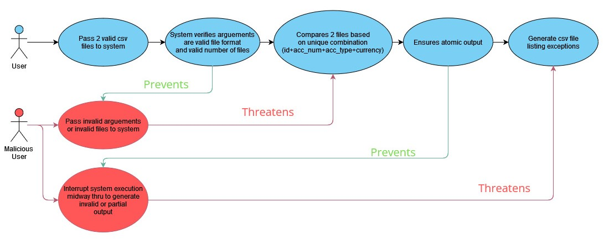

# ESC Software Testing Campaign
Name: Baarath S/O Sellathurai  
ID: 1005433  
Cohort/Group: C02G01  

# Reconcillation
This reconcillation system will compare 2 csv files.  
The current implementation expects the following format for the csv file: "Customer ID#",	"Account No.",	"Currency",	"Type",	"Balance"

### Use Case Diagram


### Equivalence class partitioning and boundary value analysis
[BoundaryValueAnalysis_and_EquivalenceClassPartitioning](./Documents/WK09_BoundaryValueAnalysis_and_EquivalenceClassPartitioning_V2.docx)  

### Getting Started
Ensure you are using Java version 17 or higher and Oracle openJdk 18 or higher.
1. Clone repo
```
git clone https://github.com/joebaarath/1005433_ESC_Testing_Campaign
```

### Usage 1: Running reconcillation via Command Line using jar artefact with default params
1. Open cmd line and navigate to "1005433_ESC_Testing_Campaign\Recon folder" and run the following command:
```
java -jar Recon.jar "sample_file_1.csv" "sample_file_3.csv"
```
<b>Understanding the output:</b><br>
The Command line would print out helpful success/error messages.<br>
A output.csv would be generated in the recon folder. <br>
By default, the script would assume that the input csv files includes 1 line of header row <br>
By default the output csv would have a header row. <br>
If there are no difference, the output.csv would only contain the headers. <br>
If there are differences, the output.csv would indicate the 3 possible types of differences: <br><br>
<b>Difference 1</b>: Mismatch value - By default the last column in the input CSVs are used as the value comparision to check for any mismatch between the files. <br>
Indicates mismatch in the value column of 1 to 1 match between the csv file for the same Identifier columns (non-value columns) <br><br>
<b>Difference 2</b>: Missing row - Indicates that the Identifier columns (non-value columns) exists in only 1 CSV file but not the other.  <br><br>
<b>Difference 3</b>: Ambigious Duplicate Identifier - Indicates there are more than a 1 to 1 match of the same Identifier columns (non-value columns) across the 2 files. <br>

### Development Setup: To setup the reconcillation program for development using IntelliJ
1. Install IntelliJ 
2. Open IntelliJ
3. Open Project
4. Navigate to git project folder and select the "Recon" folder
5. Click "Trust Project"
6. In the project window, navigate to "src/com.esc.campaign/Main"
7. Under the "Run" file menu, click on the run to execute with preconfigured file path arguements sample_file_1.csv and sample_file_3.csv
8. Under the "Run" file menu, click on "Edit Configurations"
9. Modify the 2 cmd line arguements to other csv file paths and click okay
10. Under the "Run" file menu, click on the run to perform reconciliation on specified csv files

### Running the Unit Test or Software Test
1. Ensure development setup is completed using IntelliJ
2. Within IntelliJ, navigate to "Recon/src/test/java"
3. Open and run "ReconcilliationTest" for Unit Testing or "SystemTest" for System Testing
4. The resulting output would be the Junit Unit Testing output to indicate any failures.

### Running the Fuzzing Test
1. Ensure Python 3.10 is installed
2. Open VS Code and Open the folder "1005433_ESC_Testing_Campaign\FuzzingPython"
3. Place the latest Recon.jar file in "1005433_ESC_Testing_Campaign\FuzzingPython"
4. In VS Code, open and run "FuzzerPython.py"
The fuzzer would simulate different cases, generate input CSV files with random values with either valid or invalid csv file formats to test robustness<br/>
The fuzzer would output "FuzzerLog.log" which would include the number of cases which was successful or failed.<br>
The "FuzzerLog.log" would also include all the failed CSV file inputs with comphrensive details to aid the user's investigation
